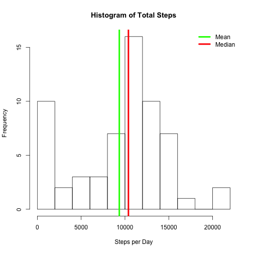
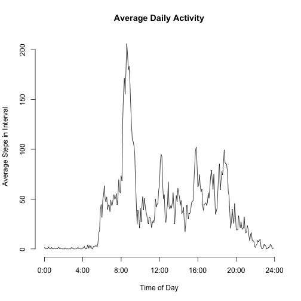
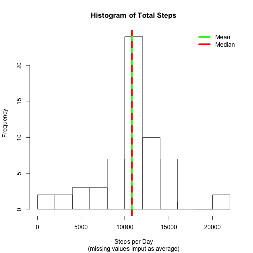
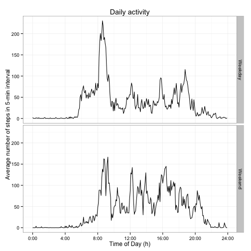

## Loading and preprocessing  
  
Load in the data provided as a zipped .csv. Convert intervals from HHMM format to the the number of mins that has passed since the beginning of the day; this corrects gaps and distributes the intervals evenly over the time period. Structure of the data frame and a summary are provided.  

```r
activity <- read.csv(unz("activity.zip", "activity.csv"), colClasses = c("integer", "Date", "integer"))
activity$interval <- 60*floor((activity$interval+1)/100) + (activity$interval %% 100)
str(activity)
```

```
## 'data.frame':	17568 obs. of  3 variables:
##  $ steps   : int  NA NA NA NA NA NA NA NA NA NA ...
##  $ date    : Date, format: "2012-10-01" "2012-10-01" ...
##  $ interval: num  0 5 10 15 20 25 30 35 40 45 ...
```

```r
summary(activity)
```

```
##      steps             date               interval     
##  Min.   :  0.00   Min.   :2012-10-01   Min.   :   0.0  
##  1st Qu.:  0.00   1st Qu.:2012-10-16   1st Qu.: 358.8  
##  Median :  0.00   Median :2012-10-31   Median : 717.5  
##  Mean   : 37.38   Mean   :2012-10-31   Mean   : 717.5  
##  3rd Qu.: 12.00   3rd Qu.:2012-11-15   3rd Qu.:1076.2  
##  Max.   :806.00   Max.   :2012-11-30   Max.   :1435.0  
##  NA's   :2304
```
  

  
##What is the mean total number of steps per day?  
  
1. Count total steps by date.

```r
total.steps <- tapply(activity$steps, activity$date, sum, na.rm = TRUE)
```
2. Mean and Median of Total Steps

```r
mean.total <- mean(total.steps)
mean.total
```

```
## [1] 9354.23
```

```r
median.total <- median(total.steps)
median.total
```

```
## [1] 10395
```
3. Histogram of steps by date. Median and Mean illustrated.

```r
hist(total.steps, breaks = 11, main = "Histogram of Total Steps", xlab = "Steps per Day")
abline(v=mean.total, col = "green", lwd = 4)
abline(v=median.total, col = "red", lwd = 4)
legend(x = "topright", legend=c("Mean", "Median"), col = c("green", "red"), bty = "n", lwd = 4)  
```

 
  
  
  
## What is the average daily activity pattern?
  
1. Determine the average step activity per interval.

```r
average.steps <- tapply(activity$steps, activity$interval, mean, na.rm = TRUE)
```
Plot the time series. Intervals are presented in 24-hour time of day on the x axis.

```r
hours <- as.numeric(names(average.steps))/60
plot(hours, average.steps, type = "l", axes = F, xlab = "Time of Day", ylab = "Average Steps in Interval", main = "Average Daily Activity")
axis(2)
axis(1, at=0:6*4, labels = paste(0:6*4, ":00", sep = ""))
```

 
  
2. Which interval contains the maximum steps?

```r
max.activity <- which(average.steps == max(average.steps))
max.activity.interval <- activity$interval[max.activity]
sprintf("%02d:%02d", floor(max.activity.interval/60), max.activity.interval %% 60)
```

```
## [1] "08:35"
```
That is the start time of the 'busiest' interval (104th).
  
## Imputing Missing Values
  
Many of the values in the dataset are NA. The total count of NAs is:

```r
sum(is.na(activity))
```

```
## [1] 2304
```
Let's fill the missing data with average values that were calculated above.

```r
fixed.activity <- transform(activity, steps=ifelse(is.na(steps), average.steps, steps))
summary(fixed.activity)
```

```
##      steps             date               interval     
##  Min.   :  0.00   Min.   :2012-10-01   Min.   :   0.0  
##  1st Qu.:  0.00   1st Qu.:2012-10-16   1st Qu.: 358.8  
##  Median :  0.00   Median :2012-10-31   Median : 717.5  
##  Mean   : 37.38   Mean   :2012-10-31   Mean   : 717.5  
##  3rd Qu.: 27.00   3rd Qu.:2012-11-15   3rd Qu.:1076.2  
##  Max.   :806.00   Max.   :2012-11-30   Max.   :1435.0
```
Now that the data has been corrected, let's compute the number of total steps again.

```r
fixed.total <- tapply(fixed.activity$steps, fixed.activity$date, sum, na.rm = TRUE)
```
Same thing for mean and median.

```r
fixed.mean <- mean(fixed.total)
fixed.mean
```

```
## [1] 10766.19
```

```r
fixed.median <- median(fixed.total)
fixed.median
```

```
## [1] 10766.19
```
Histogram of the fixed activity set.

```r
hist(fixed.total, breaks = 11, main = "Histogram of Total Steps", xlab = "Steps per Day", sub = "(missing values imput as average)")
abline(v=fixed.mean, col = "green", lwd = 4)
abline(v=fixed.median, col = "red", lwd = 4, lty = 2)
legend(x = "topright", legend=c("Mean", "Median"), col = c("green", "red"), bty = "n", lwd = 4)
```

 
  
Due to correction of missing values, the total sum of steps increases from 570608 to 6.5674 X 10^5.

```r
sum(activity$steps, na.rm = TRUE)
```

```
## [1] 570608
```

```r
sum(fixed.activity$steps)
```

```
## [1] 656737.5
```
  

## Are there differences in activity between weekdays and weekends?
  
We will generate activity data for both weekdays only and weekends only. We classify the data as either weekday or weekend and then aggregate by the corresponding intervals. We will use a side-by-side panel from the ggplot2 library plot to illustrate the difference(s).  

```r
week <- factor(weekdays(fixed.activity$date) %in% c("Saturday", "Sunday"), labels = c("Weekday", "Weekend"), ordered = FALSE)

week.steps <- aggregate(fixed.activity$steps, by = list(interval = fixed.activity$interval, weekday = week), mean)

library(ggplot2)
gplt <- ggplot(week.steps, aes(interval/60, x))
gplt + geom_line() + facet_grid(weekday ~ .) +
    scale_x_continuous(breaks=0:6*4, labels=paste(0:6*4,":00", sep="")) +
    theme_bw() +
    labs(y="Average number of steps in 5-min interval") +
    labs(x="Time of Day (h)") +
    labs(title="Daily activity")
```

 
  
From the graphs, it is apparent that early morning activity is highest during the weekdays (presumably before work), whereas overall activity is much higher during thw weekends (more free time to do activity).   
  
Would that we were to imput according to weekday average and weekend average, respectively, the differences would not be so stark.  
